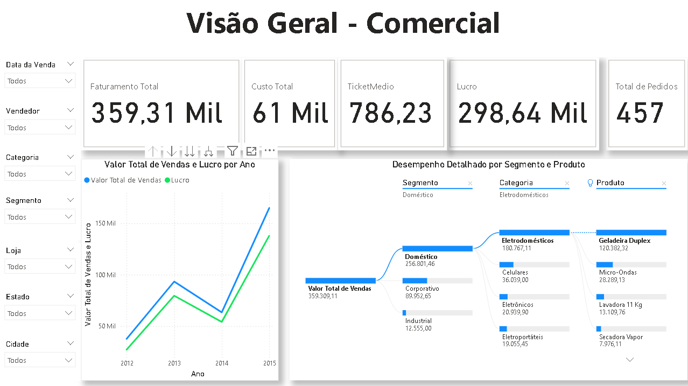
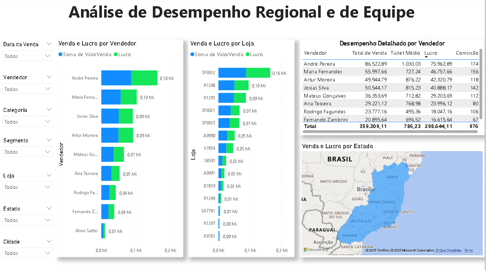
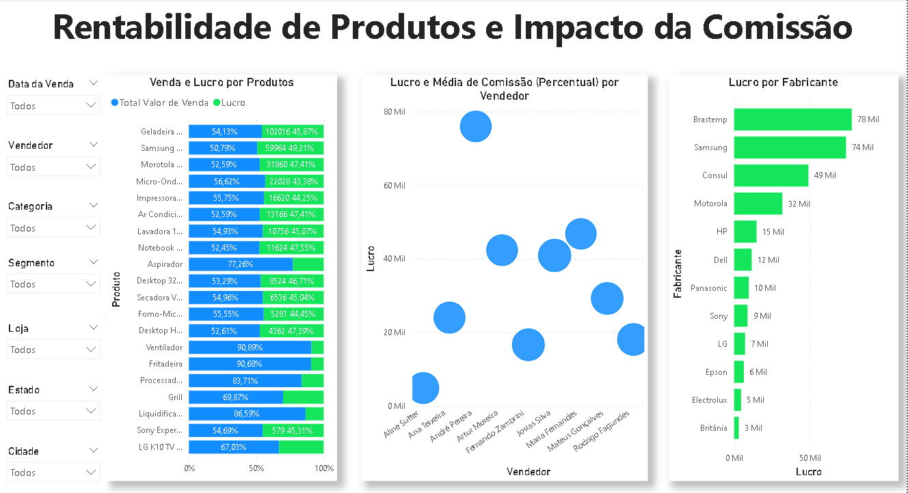

# Projeto de Portfólio: Dashboard de Performance Comercial no Power BI

## Uma Jornada Analítica: Otimizando Vendas e Lucro com Dados

Olá! Eu sou **Heitor Pereira Fernandes Oliveira**, e este projeto de portfólio demonstra minha capacidade de mergulhar em dados comerciais para desvendar insights que impulsionam vendas e lucratividade. Este dashboard não é apenas uma representação visual; ele narra a jornada de análise de dados, desde a preparação até a entrega de informações acionáveis para decisões estratégicas.

### O Desafio de Negócio

No dinâmico ambiente comercial, entender o "porquê" por trás dos números é crucial. Este projeto foi concebido para responder a perguntas-chave que impactam diretamente a performance comercial:

* Qual é a nossa performance geral em vendas, custo e lucro?
* Quem são nossos vendedores de destaque e quais regiões geram mais receita?
* Como podemos otimizar a rentabilidade dos produtos e qual o impacto da comissão dos vendedores?
* Quais são os segmentos e categorias de produtos que mais contribuem para o faturamento e lucro?

### A Solução Analítica: Um Dashboard Interativo e Estratégico no Power BI

Para transformar dados brutos em inteligência comercial, desenvolvi um dashboard interativo dividido em três páginas, cada uma abordando uma dimensão crítica da performance.

#### 📊 Fontes de Dados

O projeto utilizou um dataset simulado de dados comerciais, contendo aproximadamente **500 registros** de transações de vendas. As colunas principais incluem:
* `ID-Produto`
* `Produto`
* `Categoria`
* `Segmento`
* `Fabricante`
* `Loja`
* `Cidade`
* `Estado`
* `Vendedor`
* `ID-Vendedor`
* `Comissão (Percentual)`
* `Data Venda`
* `ValorVenda`
* `Custo`

#### 🛠️ Tecnologias e Habilidades Demonstradas

* **Microsoft Power BI Desktop:** Utilizado para todas as etapas do processo de Business Intelligence:
    * **ETL (Extract, Transform, Load):** Conexão, limpeza e transformação dos dados para garantir sua qualidade e usabilidade.
    * **Modelagem de Dados:** Criação de relacionamentos entre tabelas e otimização do modelo para performance analítica.
    * **DAX (Data Analysis Expressions):** Desenvolvimento de medidas e colunas calculadas complexas (`Lucro`, `Ticket Médio`, `Média de Comissão`) para extrair insights profundos.
    * **Visualização e Storytelling:** Seleção estratégica de visuais (KPIs, gráficos de linha, barras, dispersão, mapas) e design de layout para apresentar a narrativa de dados de forma clara e impactante.
* **Análise Exploratória de Dados (EDA):** Investigação inicial dos dados para identificar padrões, tendências e anomalias, informando as decisões de design e as métricas-chave.
* **Foco em Problemas de Negócio:** Habilidade de traduzir desafios comerciais em análises quantitativas e insights acionáveis que orientam a tomada de decisão.
* **Experiência do Usuário (UX) em Dashboards:** Implementação de filtros globais consistentes e interativos em todas as páginas para uma navegação intuitiva.

---

## Estrutura do Dashboard e Principais Insights

O dashboard é composto por três páginas interativas, cada uma fornecendo diferentes níveis de profundidade na análise comercial:

### **1. Visão Geral - Comercial**

Esta página oferece uma visão consolidada da performance de vendas, custo e lucro da empresa, juntamente com tendências temporais e uma análise por segmento/produto.

* **KPIs de Alta Performance:** `Faturamento Total`, `Custo Total`, `Lucro`, `Ticket Médio` e `Total de Pedidos`, fornecendo um resumo financeiro imediato.
* **Tendências de Vendas e Lucro:** Gráfico de linha que demonstra a evolução do `Valor de Venda` e do `Lucro` ao longo do tempo, identificando tendências e sazonalidades.
* **Desempenho Detalhado por Segmento e Produto:** Matriz que permite drill-down/up para explorar a contribuição de vendas e lucro por `Segmento` e por `Produto` dentro de cada segmento.

### **2. Análise de Desempenho Regional e de Equipe**

Esta seção aprofunda na performance geográfica e individual da equipe de vendas, destacando áreas de sucesso e oportunidades de melhoria.

* **Vendas e Lucro por Vendedor:** Gráfico de barras que compara a performance de `Vendas` e `Lucro` por `Vendedor`, permitindo a identificação dos top performers.
* **Vendas e Lucro por Loja:** Análise comparativa da contribuição de `Vendas` e `Lucro` por `Loja`, essencial para gestão de pontos de venda.
* **Desempenho Detalhado por Vendedor:** Tabela que fornece uma visão granular de cada `Vendedor`, incluindo `Total de Vendas`, `Total de Lucro` e `Comissão (Percentual)`.
* **Mapa de Vendas e Lucro por Estado:** Visualização geográfica que sombreia os `Estados` do Brasil com base no `Valor de Venda` e `Lucro`, facilitando a identificação rápida de regiões de alta e baixa performance.

### **3. Rentabilidade de Produtos e Impacto da Comissão**

A página final se aprofunda na rentabilidade dos produtos e na correlação entre a comissão e o desempenho dos vendedores.

* **Vendas e Lucro por Produtos:** Gráfico de barras que mostra a `Venda` e o `Lucro` para cada `Produto`, com foco na proporção de lucro para vendas, auxiliando na otimização de margens.
* **Lucro e Média de Comissão Percentual por Vendedor (Scatter Plot):** Um gráfico de dispersão que correlaciona a `Média de Comissão Percentual` recebida pelo `Vendedor` com o `Lucro` total que ele gera. O tamanho da bolha representa o `Valor de Venda` total do vendedor. Este visual é crucial para entender a eficiência da estrutura de comissão.
* **Lucro por Fabricante:** Gráfico de barras que detalha a contribuição do `Lucro` por `Fabricante`, identificando os parceiros mais rentáveis.

---

## Dashboard Interativo (Power BI Service)

**Explore o dashboard completo e interaja com os dados online aqui:**
[**Acesse o Dashboard de Performance Comercial no Power BI Service!**](SUA_URL_DO_POWER_BI_SERVICE_AQUI)

*(Lembre-se de substituir `SUA_URL_DO_POWER_BI_SERVICE_AQUI` pelo link real do seu dashboard após a publicação no Power BI Service. Se não puder publicar no momento, você pode remover esta seção temporariamente ou mencionar que o arquivo `.pbix` está disponível para download.)*

## Como Abrir e Explorar o Projeto Localmente

Para explorar este dashboard em seu próprio Power BI Desktop:

1.  **Pré-requisito:** Baixe e instale o [Microsoft Power BI Desktop](https://powerbi.microsoft.com/desktop/).
2.  **Clone o Repositório:** Utilize o Git para clonar este repositório para o seu ambiente local.
3.  **Abra o Arquivo:** Navegue até a pasta `dashboards` dentro do repositório clonado e abra o arquivo `Dashboard_Comercial.pbix`.

## Conecte-se Comigo!

Estou sempre em busca de novas oportunidades e desafios em Análise de Dados. Sinta-se à vontade para se conectar:

* **LinkedIn:** [Heitor Pereira Fernandes Oliveira](https://www.linkedin.com/in/heitor-pereira-fernandes-oliveira-412aa3145/)
* **Email:** [heitorfernandesoliveira@outlook.com](mailto:heitorfernandesoliveira@outlook.com)

---
*Este projeto foi desenvolvido por **Heitor Pereira Fernandes Oliveira** como parte do meu portfólio de Análise de Dados.*